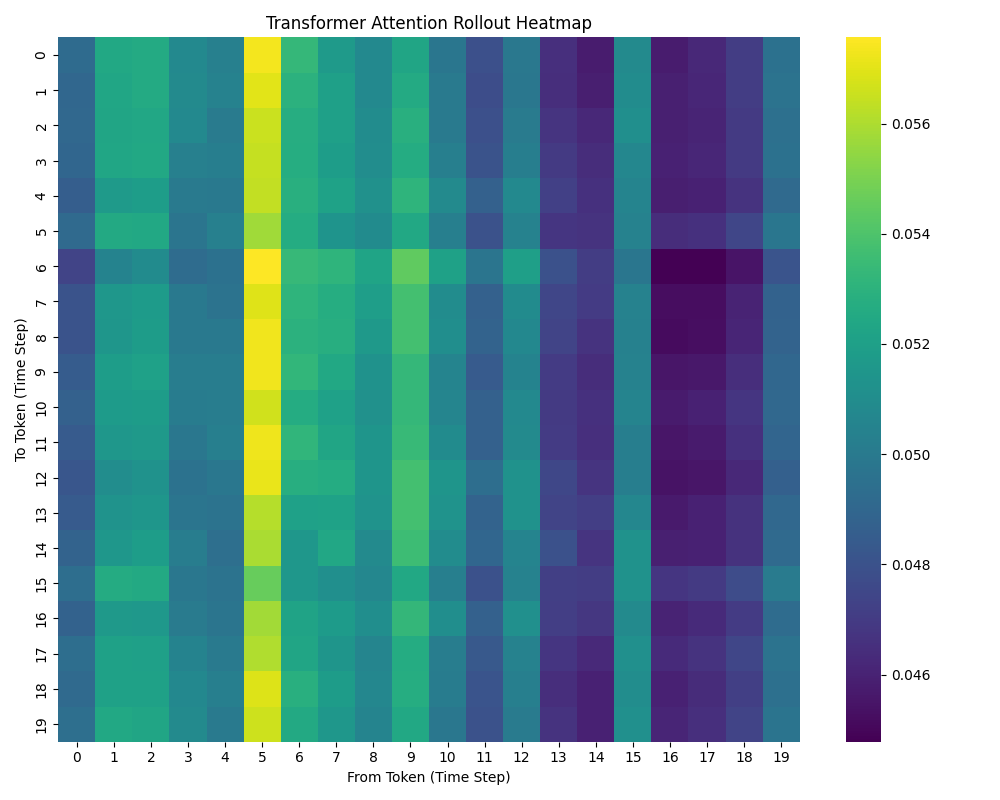
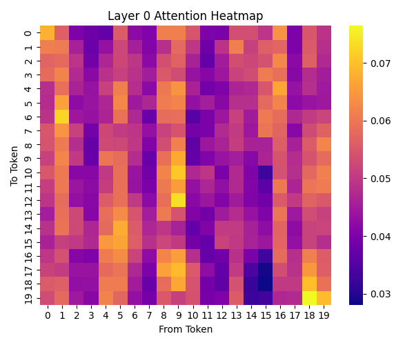
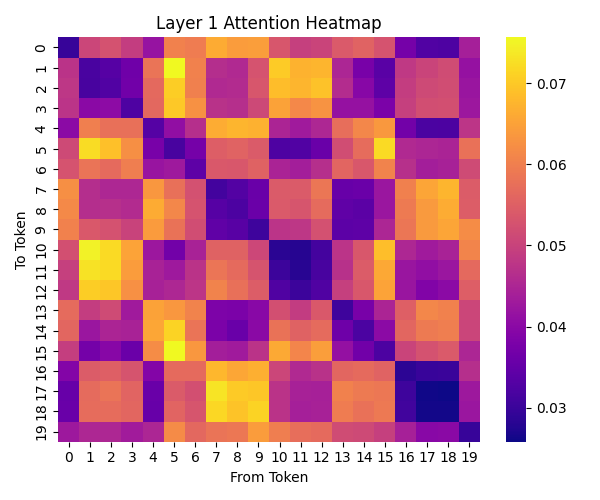
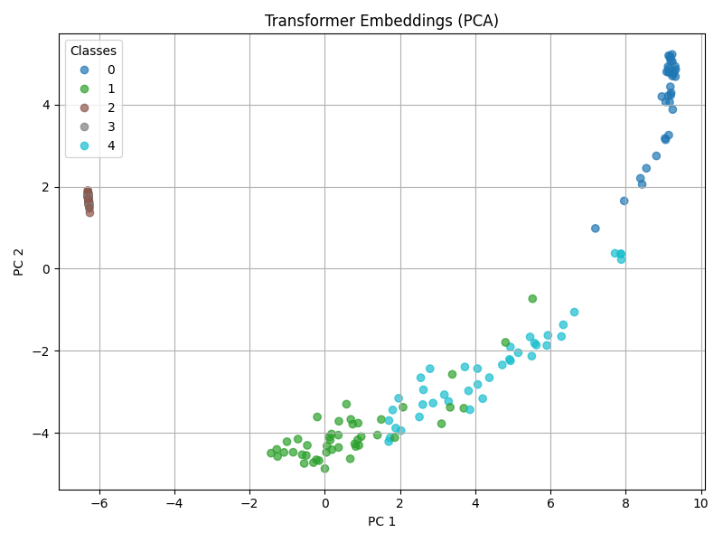
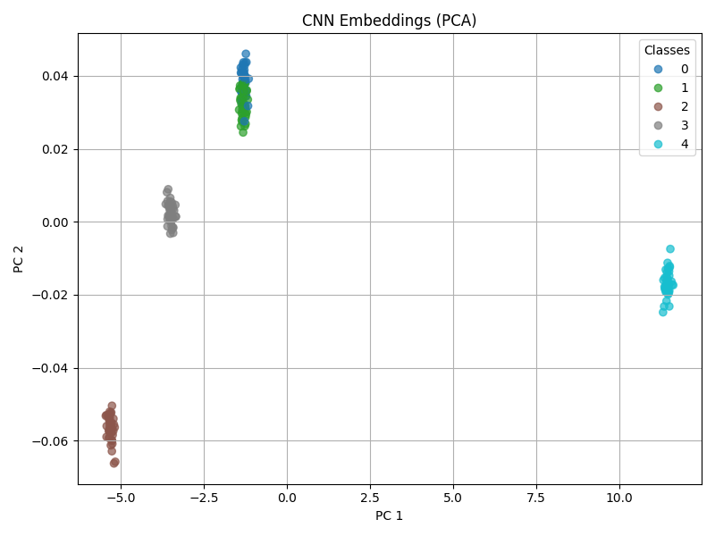
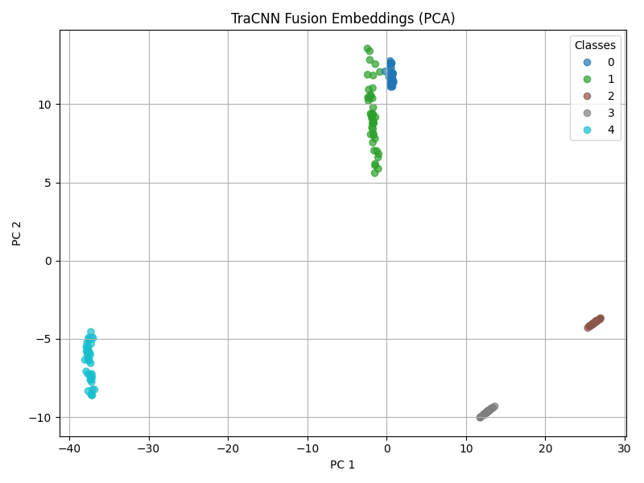
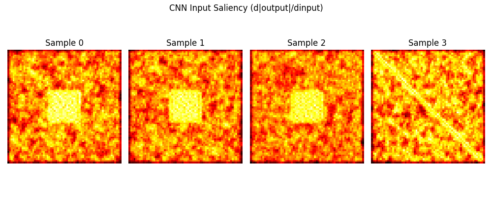
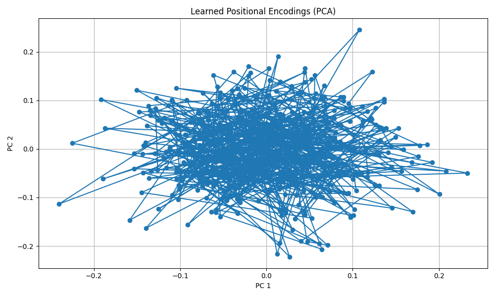

# TraCNN Experiment Report: `exp_001_tracnn_bootstrap`

This document summarizes the results and visualizations obtained from the initial TraCNN architecture test using synthetic visual and temporal data. The model combines CNN for spatial pattern extraction with a Transformer for temporal reasoning.

---

## Transformer Attention Rollout

- The attention rollout indicates strong temporal focus around the 5th timestep.
- This suggests a key moment in the sequence significantly influences downstream attention.

---

## Layer-wise Attention (Transformer)

**Layer 0:**

**Layer 1:**

- Layer 0 shows uniform spread with light clustering — ideal for early feature correlation.
- Layer 1 exhibits more chaotic and discriminative attention — indicating deeper feature disentanglement.

---

## Transformer Embedding PCA

- Temporal embeddings are increasingly separable across classes.
- Shows that the Transformer head is encoding strong semantic information over time.

---

## CNN Embedding PCA

- CNN outputs show clear spatial clustering, validating the image pattern generator’s utility.
- Some classes align closely — suggesting input motif similarity.

---

## TraCNN Fusion Embedding PCA

- Fusion outputs demonstrate greater inter-class separation than individual modules.
- Highlights the success of TraCNN in leveraging both modalities effectively.

---

## CNN Input Saliency Maps

- Clear saliency regions match synthetic visual cues (e.g. squares, diagonals).
- Confirms that CNN is not just reacting to noise, but actually keying into class-specific patterns.

---

## Positional Encoding PCA

- While noisy, the learned positional encodings exhibit a smooth distribution.
- Reflects a robust temporal structure being understood by the model.

---

## Conclusion

The TraCNN v1 system demonstrates a promising start in hybrid spatio-temporal representation learning. Both CNN and Transformer modules contribute meaningfully to the decision process, and their integration via the fusion layer significantly improves class separability.

Future work will include:
- Introducing real or more complex multimodal synthetic data
- Testing transferability of learned embeddings
- Expanding modality routing via dynamic fusion control
